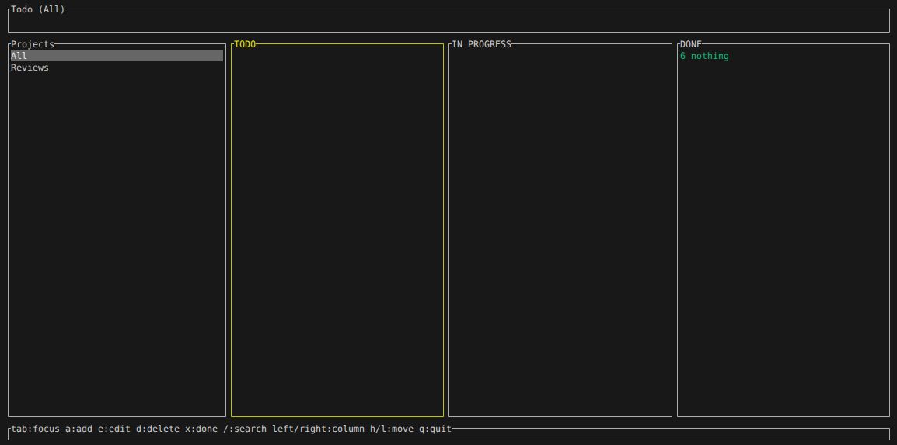
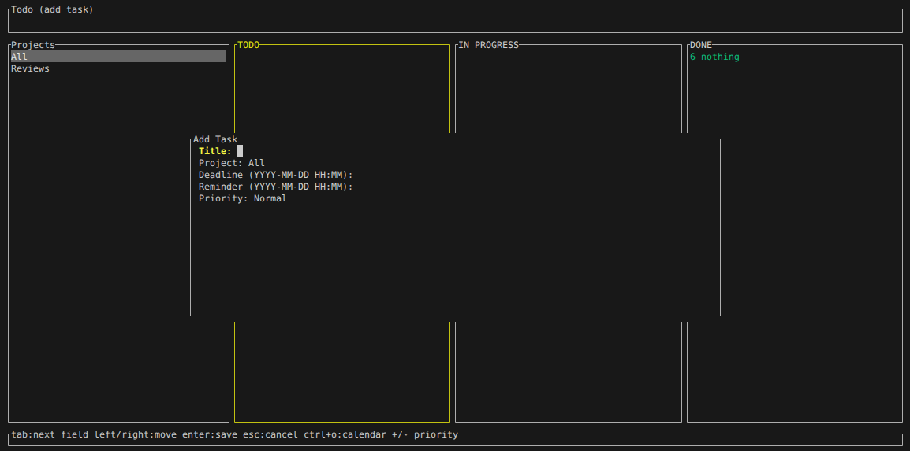

# Todo CLI

A lightweight Linux todo manager written in Rust.

Features:
- CLI task management (add, list, done, delete)
- Task priorities (Very High, Medium High, High, Normal, Low)
- SQLite persistence
- Deadlines and reminders
- Desktop notifications via libnotify
- systemd user timer for reminder checks (Linux)
- Interactive TUI (ratatui + crossterm) with search and calendar picker

<p align="center">
  
  
</p>


## Requirements

- Rust toolchain (cargo)
- SQLite development library
  - Debian/Ubuntu: `sudo apt-get install -y libsqlite3-dev`
- libnotify runtime and development files
  - Debian/Ubuntu: `sudo apt-get install -y libnotify-bin libnotify-dev`

## Build

From the project directory:

```bash
source "$HOME/.cargo/env"
cargo build --release
```

Note:
- If you used `rustup`, `cargo` may not be on your PATH in new shells until you run `source "$HOME/.cargo/env"` or restart the terminal.
- The correct release command is `cargo build --release` (with `--`).

Binary output:

```
target/release/todo
```

Optional local install:

```bash
cp target/release/todo ~/.local/bin/
```

## One-Step Install

Linux (builds the binary, installs to `~/.local/bin/`, and installs/enables the systemd reminder timer by default):

```bash
./install-linux.sh
```

To use cron instead of systemd:

```bash
TODO_SCHEDULER=cron ./install-linux.sh
```

macOS (builds the binary, installs to `~/.local/bin/`, and installs/enables a launchd reminder agent by default):

```bash
./install-macos.sh
```

To use cron instead of launchd:

```bash
TODO_SCHEDULER=cron ./install-macos.sh
```

Windows (builds the binary, installs to `%USERPROFILE%\.cargo\bin`, and creates a Task Scheduler job):

```bat
install-windows.bat
```

## Run (CLI)

From source without install:

```bash
cargo run -- add "Write paper" --deadline "2026-03-15 18:00" --remind "2026-03-15 16:00" --desc "Email about blah blah blah blah, should not forget xyz points"
cargo run -- add "Write paper" --priority "very high"
cargo run -- add "Backup research data" --repeat weekly --deadline "2026-03-15 18:00"
cargo run -- list
cargo run -- today
cargo run -- week
cargo run -- done 3
cargo run -- delete 2
```

If installed:

```bash
todo add "Write paper" --deadline "2026-03-15 18:00" --remind "2026-03-15 16:00" --desc "Email about blah blah blah blah, should not forget xyz points"
todo add "Write paper" --priority "very high"
todo add "Backup research data" --repeat weekly --deadline "2026-03-15 18:00"
todo list
todo today
todo week
todo done 3
todo delete 2
```

Notes:
- Datetime format: `YYYY-MM-DD HH:MM` (local time)
- Description: `--desc "..."` (alias for `--description`)
- Recurrence: `--repeat daily|weekly|monthly|yearly`
- DB location: `~/.todo/tasks.db`
- Override DB path for testing: `TODO_DB_PATH=/path/to/tasks.db`
- Priority values: `very high`, `medium high`, `high`, `normal`, `low` (also accepts `vh`, `mh`, `h`, `n`, `l`)

## Run (TUI)

From source:

```bash
cargo run -- ui
```

If installed:

```bash
todo ui
```

TUI key bindings (normal mode):
- `q` quit
- `a` add task
- `e` edit task
- `x` mark done
- `d` delete task
- `/` search
- `Up/Down` navigate

Add task mode:
- `Tab` switch fields
- `Left/Right` move cursor within text fields
- `Enter` save
- `Esc` cancel
- `Ctrl+O` open calendar picker (for deadline/reminder fields)
- `+` / `-` change priority (when Priority field is selected)
- Fields include Title, Project, Deadline, Reminder, Repeat, Priority, and Description.

Calendar picker:
- Arrow keys move day/week
- `PgUp/PgDn` change month
- `Enter` select
- `Esc` cancel

## Notifications

Run reminders manually:

```bash
cargo run -- notify
```

Or if installed:

```bash
todo notify
```

By default, reminders are snoozed for 15 minutes after each notification. The popup includes a Snooze button (if supported by your notification server).

You can customize snooze duration (minutes):

```bash
todo notify --snooze-minutes 30
```

## Linux systemd User Timer

Install unit files:

```bash
mkdir -p ~/.config/systemd/user
cp systemd/todo-reminder.service ~/.config/systemd/user/
cp systemd/todo-reminder.timer ~/.config/systemd/user/
```

Enable timer:

```bash
systemctl --user daemon-reload
systemctl --user enable todo-reminder.timer
systemctl --user start todo-reminder.timer
```

This triggers `todo notify` every minute.

## Linux cron (Optional)

```bash
* * * * * ~/.local/bin/todo notify
```

## macOS launchd

Create a LaunchAgent:

```bash
mkdir -p ~/Library/LaunchAgents
cat > ~/Library/LaunchAgents/com.todo.reminder.plist <<EOF
<?xml version="1.0" encoding="UTF-8"?>
<!DOCTYPE plist PUBLIC "-//Apple//DTD PLIST 1.0//EN" "http://www.apple.com/DTDs/PropertyList-1.0.dtd">
<plist version="1.0">
<dict>
  <key>Label</key>
  <string>com.todo.reminder</string>
  <key>ProgramArguments</key>
  <array>
    <string>$HOME/.local/bin/todo</string>
    <string>notify</string>
  </array>
  <key>StartInterval</key>
  <integer>60</integer>
  <key>RunAtLoad</key>
  <true/>
</dict>
</plist>
EOF
```

Load it:

```bash
launchctl load -w ~/Library/LaunchAgents/com.todo.reminder.plist
```

## macOS cron (Optional)

```bash
* * * * * ~/.local/bin/todo notify
```

## Windows Task Scheduler

```bat
schtasks /Create /SC MINUTE /MO 1 /TN "TodoReminder" /TR "\"%USERPROFILE%\\.cargo\\bin\\todo.exe\" notify" /F
```
